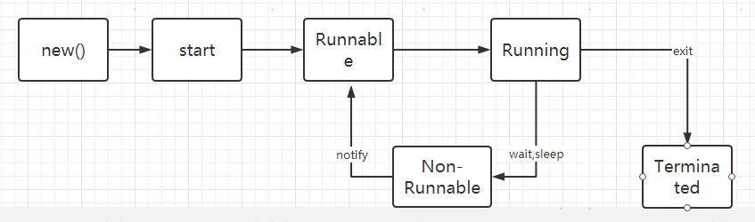
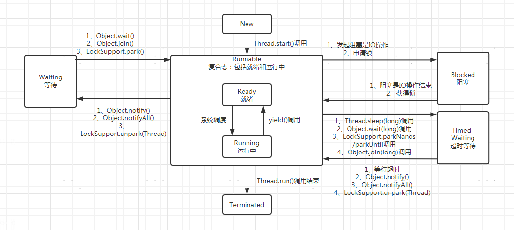

学习笔记

## 1、进程与线程区别

```
线程：操作系统能并行的任务随着CPU核数增加而增加，这时候就需要有一种最基础的让操作系统来调度计算任务的单元，它就是线程。CPU运行的时候以线程为调度单位。

进程：是操作系统启动的一个单位，启动了一个进程，相当于是启动了一个应用程序了，是操作系统分配资源的一个基本单位。
```

## 2、裸线程

```
每一个Java的线程，只要new出来，都会对应着操作系统的一个线程。
```

## 3、守护线程

```
1、先理解用户线程：执行与应用程序相关的计算任务的线程，只要用户线程存在，就代表着还有类似的业务逻辑还没处理完，JVM就不会退出，进程就不会结束。
2、但，总需要一些没有人关注的，也就是随着应用程序启动就会存在的，在默默工作，用来额外支撑程序运行的线程。只要应用程序干完活（即用户线程都执行完了），那这些没人关注的线程也就随之自动结束的。这种线程就叫：守护线程。
3、守护线程，可以理解成也是一个特殊的用户线程，只是程序的结束不需要等待它们的结束，而是程序一结束（JVM退出），它们就自动或被迫的马上被结束掉。可以说，守护线程，就是为了守护用户线程而存在的（为用户线程服务的线程），没有了用户线程，它就没有了守护的意义。
4、思考一下JVM的垃圾收集线程，他就是一个守护线程。
5、守护线程，会在jvm退出的时候也会立即中断退出，也就是，它可能存在没有执行完当次过程的情况。因此，守护线程不能持有任何需要关闭的资源，例如打开文件等，因为JVM退出的时候，守护线程没有任何机会来关闭文件，导致数据丢失，或其他程序无法操作该文件。
6、设置守护线程，必须在线程启动之前设置，即线程Start之前，因为运行中的用户线程是变成守护线程的。
```

## 4、线程的启动方式和区别

```java
线程启动的方式有两种：
1、继承Thread类，子类实现里面的run方法，这是使用了继承的技术。
2、实现Runable接口，并将new出来的对象作为Thread的构成参数去new一个线程。这是使用了组合的技术。
 public static void main(String[] args) {
        for(int i=0; i<10; i++){
            Thread threadRunable = new Thread(new ThreadRunable());
            threadRunable.setName("实现Runable接口方式线程：第"+i+"个");
            threadRunable.start();
        }
        for(int i=0; i<10; i++){
            ThreadInherit threadInherit = new ThreadInherit();
            threadInherit.setName("继承方式线程：第"+i+"个");
            threadInherit.start();
        }
    }
    static class ThreadInherit extends Thread{
        @Override
        public void run() {
            try {
                Thread.sleep(2000);
            } catch (InterruptedException e) {
                e.printStackTrace();
            }
            System.out.println("当前线程："+this.getName());
        }
    }
    static class ThreadRunable implements Runnable{

        @Override
        public void run() {
            try {
                Thread.sleep(2000);
            } catch (InterruptedException e) {
                e.printStackTrace();
            }
            Thread t = Thread.currentThread();
            System.out.println("当前线程："+t.getName());
        }
    }
    
这里要注意：启动线程，必须使用start方法，如果用run方法，则类似一个调用一个实例对象的方法，是同步的。
采用Ruanble的方式：
4.1 它是一个任务对象，可复用，多个线程实例可共享同一个Runable实例。
```

## 5、线程的状态

线程的状态有：New（创建但未启动），Runnable（运行复合态：运行中Running，准备中Ready），Blocked（阻塞），Waiting（等待），Time_Waiting（超时等待），Terminate（终止的）

### 5.1 直观理解的状态翻转图

```
1：JVM创建Thread对象（New操作），还没有执行start语句，此时，他是JVM维护的一个线程对象
2：当执行了start代码后，jvm才会真正的去创建系统线程，这个是有系统内核实现的
3：操作系统创建了线程，不是会立即就执行的，而是等待系统调度，在这个时候，线程处于Runnable的Ready态。
4：等到系统调度改线程后，拿到CPU执行的时间片，他才会开始真正的运行，此时，线程处于Running态。
5：线程可能会因为某些原因，变成需要等待的状态，处于等待的线程，必须通过某种机制唤醒才能重新回到Runnable态。
6：等线程执行完后，就会销毁，终止。
```



### 5.2 线程生命周期中的状态



## 6、Join的二次理解

```Java
public class JoinDemo {
    public static void main(String[] args) {
        Object oo = new Object();
        JoinTestThread thread1 = new JoinTestThread("thread1 -- ");
        //oo = thread1;
        thread1.setOo(oo);
        thread1.start();
        
        synchronized (oo) {  // 这里用oo或thread1/this
            for (int i = 0; i < 100; i++) {
                if (i == 20) {
                    try {
//                        oo.wait(0);
                        thread1.join();
                    } catch (InterruptedException e) {
                        e.printStackTrace();
                    }
                }
                System.out.println(Thread.currentThread().getName() + " -- " + i);
            }
        }
    }
}

class JoinTestThread extends Thread{
    private String name;
    private Object oo;

    public void setOo(Object oo) {
        this.oo = oo;
    }

    public JoinTestThread(String name) {
        this.name = name;
    }

    @Override
    public void run() {
        synchronized (oo){
            for (int i=0; i<100; i++){
                System.out.println(name + i);
            }
        }
    }
}
分两种情况运行：
    1、如果main线程的采用synchronized (thread1)，子线程采用synchronized (this)，能够达到我们的目标效果。这里同步块的锁是同一个对象。
    2、如果main线程的采用synchronized (oo)，子线程采用synchronized (oo)，会造成死锁，main线程一直在等待子线程执行完想要重新获得锁，但是子线程没有执行到同步块的内容，也就是子线程也在等待同一锁。这里同步块的锁是同一个对象（main线程new出来的对象）。
为什么会出现这种情况呢？这就要从Join和wait的逻辑说起了。先以子线程采用synchronized (this)为例
    1、Join的实现底层是使用了wait的机制。
    2、Object.join方法是一个被Synchronized修饰的方法，所以，该方法是一个同步方法（也称临界区），synchronized修饰在方法上的非静态方法，同步锁是当前实例对象Object。
    3、Object.wait(),进入等待队列，且释放当前线程的持有的object对象锁（此处，object为子线程实例对象）。
    4、因此，当main线程执行了Object.join方法后（Object为子线程实例对象thread1），会先拿到锁（锁对象为thread1这个实例对象）
    5、执行一系列的判断后，需要暂停main线程，因此执行了Object.wait方法（Object为子线程实例对象thread1），因此main线程释放了当前持有的Object对象锁（此处，object为子线程实例对象）。
    6、此时，Object对象锁处于没有人持有的状态，而子线程的run方法的同步块正在申请该子线程的this对象锁，this也就是子线程实例对象thread1，因此子线程的同步块会拿到这个锁，所以子线程里同步块的代码得以执行，执行完后就会notify之前暂停的main线程。如何notify的机制后面再说了。
    7、main线程被唤醒后，就处于阻塞的等待队列，然后尝试获取之前释放掉的锁，一旦获得到锁，那就能马上进入Runnable状态了，得以被CPU调度到和执行。
    8、此时，因为子线程已经执行完，所以释放掉锁了，因此main线程能申请到Object对象锁。所以不会造成死锁，达到目标效果。
```

## 7、线程池

### 7.1 